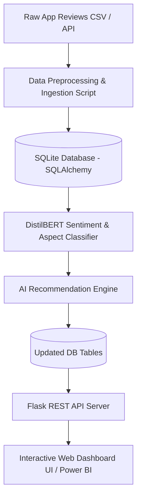

# 📱 App Review Sentiment Dashboard (BERT + AI Recommendation Engine)

[](https://www.python.org/)
[](https://flask.palletsprojects.com/)
[](https://huggingface.co/transformers/)
[](https://www.sqlalchemy.org/)
[](LICENSE)

An end-to-end AI-powered analytics platform that processes mobile app store reviews, runs Hugging Face **BERT/DistilBERT** sentiment and aspect extraction, calculates automated **issue urgency metrics**, and presents real-time executive insights via a live **Web Dashboard UI** and **Flask REST API**.

---

## 🌟 Key Highlights & Features

* **Data Preprocessing & Annotation**: Automates text cleaning, HTML tag removal, whitespace standardization, and DB ingestion.
* **Hugging Face BERT Sentiment Analysis**: Analyzes review text to predict sentiment labels (`Positive`, `Negative`, `Neutral`) with confidence scores.
* **Aspect Category Extraction**: Automatically tags feedback into product areas:
  - 🐛 `Bug / Crash`
  - ⚡ `Performance / Speed`
  - 🎨 `UI / UX`
  - 💰 `Pricing / Subscription`
  - 💡 `Feature Request`
* **Automated Recommendation Engine**: Calculates an issue **Urgency Score**:
  $$\text{Urgency Score} = \text{Negative Review Count} \times (5 - \text{Average Rating})$$
  Generates prioritized developer action items (High 🔴, Medium 🟡, Low 🟢).
* **Live Glassmorphism Web Dashboard**: Responsive dark-mode web app featuring KPI metrics, Chart.js visualizations (Donut & Bar charts), real-time review filters, and a **Submit & Analyze Review** modal.

---

## 🏗️ Architecture & Data Flow



---

## 📁 Repository Structure

```text
.
├── api/
│   └── app.py                  # Flask REST API & static web router
├── data/
│   └── sample_reviews.csv      # Sample app store reviews dataset
├── database/
│   ├── db.py                   # SQLAlchemy engine & session factory
│   └── models.py               # DB Schemas (Review, SentimentAnalysis, Recommendation)
├── models/
│   ├── bert_sentiment.py       # DistilBERT NLP inference & aspect tagger
│   └── recommender.py          # Priority recommendation engine
├── web/
│   ├── index.html              # Glassmorphism Dashboard UI
│   ├── style.css               # Dark theme stylesheet & layout
│   └── app.js                  # Async REST API consumer & Chart.js logic
├── .gitignore                  # Git ignore file
├── data_preprocessing.py       # Data cleaning & DB seeding script
├── README.md                   # Project documentation
└── requirements.txt            # Python dependencies
```

---

## 🚀 Quick Start Guide

### 1. Clone the Repository
```bash
git clone https://github.com/YOUR_USERNAME/app-review-sentiment-dashboard.git
cd app-review-sentiment-dashboard
```

### 2. Install Dependencies
```bash
pip install -r requirements.txt
```

### 3. Initialize & Ingest Dataset
```bash
python data_preprocessing.py
```

### 4. Run Sentiment Analysis & Recommendation Engine
```bash
python models/bert_sentiment.py
python models/recommender.py
```

### 5. Launch Flask API & Web Dashboard
```bash
python api/app.py
```
Open your browser and visit: **`http://127.0.0.1:5000/`**

---

## 📡 REST API Reference

| Endpoint | Method | Description |
| :--- | :--- | :--- |
| `/` | `GET` | Serves live Web Dashboard UI |
| `/api/health` | `GET` | API Health Status |
| `/api/dashboard/stats` | `GET` | Returns NSS, average rating, and aspect breakdowns |
| `/api/recommendations` | `GET` | Returns prioritized action items ordered by urgency score |
| `/api/reviews` | `GET` | Returns all processed reviews with sentiment & aspect tags |
| `/api/reviews` | `POST` | Ingests a new user app review |
| `/api/analyze` | `POST` | Triggers sentiment & recommendation pipeline on new reviews |

---

## 📜 License
This project is licensed under the **MIT License**.
